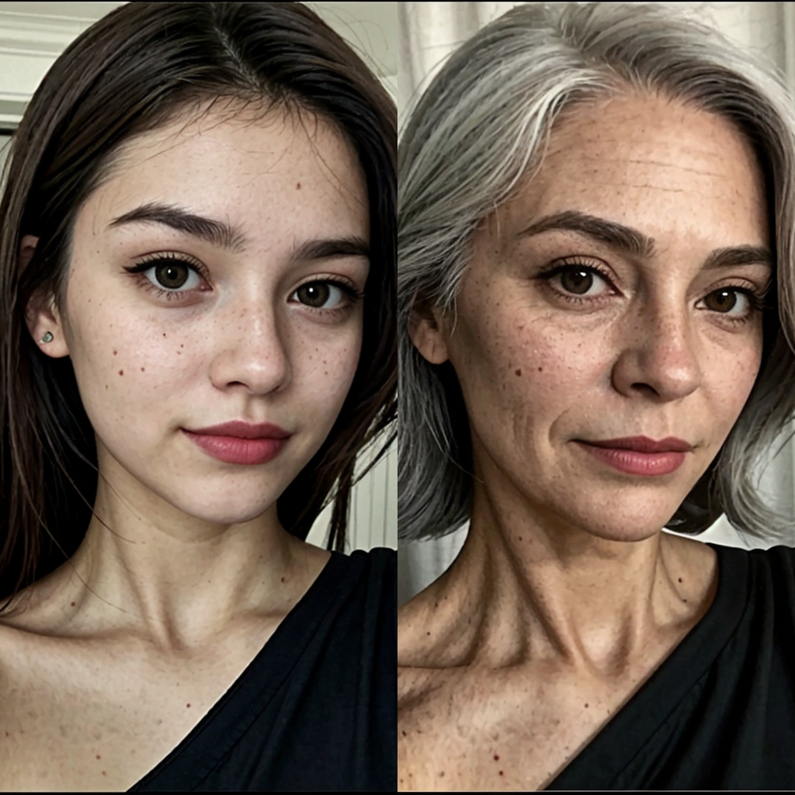
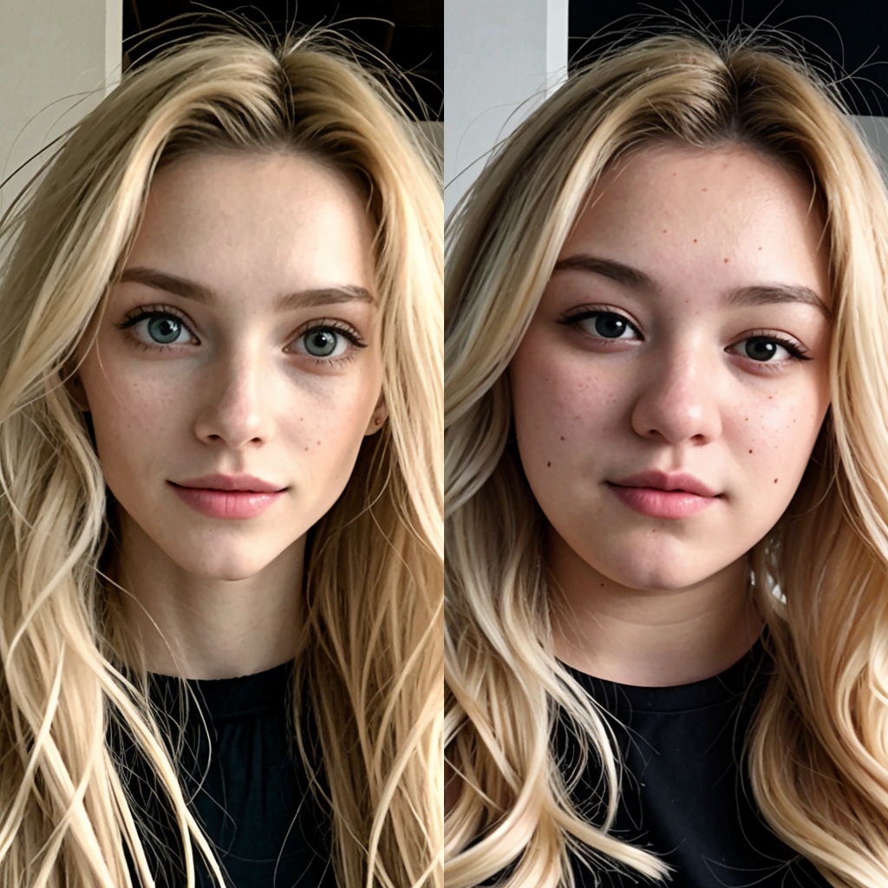
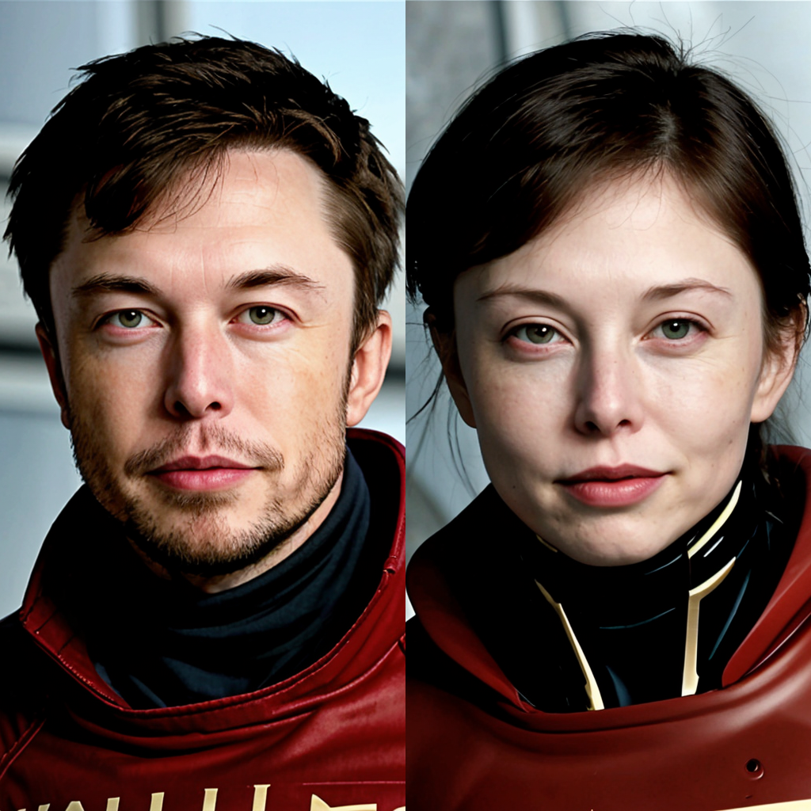

# LoRA-Slider

  

---

A LoRA-Slider training script. A LoRA-Slider model can be trained without image samples. You can modify the weight of the LoRA-Slider to control a weight of a specific concept, such as age, weight and gender. A few trained Lora-Slider model can be downloaded in [here](https://civitai.com/models/281934/lora-slider).


## Usage

1.Prepare a *.json config file like this

```json
[
    {
        "target_prompt": "the concept to be enhanced",
        // such as "elderly person"
        "trigger_prompt": "trigger word", 
        // such as "person"
        "trigger_lora_weight": "positive", 
        // "positive" represents the concept will be enhanced with a positive weight of lora and be suppressed with a negative weight of lora.
        "guidance_scale": 3.0 
        // the guidance scale of target_prompt on trigger_prompt
    },
    {
        "target_prompt": "the concept to be enhanced",
        // such as "3-year-old person"
        "trigger_prompt": "trigger word", 
        // such as "person"
        "trigger_lora_weight": "negative", 
        // "negative" represents the concept will be enhanced with a negative weight of lora and be suppressed with a positive weight of lora.
        "guidance_scale": 3.0 
        // the guidance scale of target_prompt on trigger_prompt
    }
]

```
A few example *.json config files have been prepared in ./config folder.


2.Run python script `train_lora_slider.py` in command line.

```bash
accelerate launch train_lora_slider.py --pretrained_model_name_or_path runwayml/stable-diffusion-v1-5 --prompt_config_path config/age_slider.json
```
Note that you need to run `accelerate config` in CLI at the first time.
The script saves a diffusers LoRA file in the output directory. Pass
`--save_webui_checkpoint` if you also want a WebUI compatible
`pytorch_lora_weights_kohya.safetensors` file. If you have other diffusers
LoRA files, you can convert them manually:
```bash
python convert_diffusers_sdxl_lora_to_webui.py <input_file> <output_file>
```

To train on an SDXL checkpoint saved in the sd-scripts PEFT format, pass the
checkpoint path to `train_lora_slider_xl.py` via `--pretrained_peft_model_path`.

## Reference
1. https://github.com/p1atdev/LECO.git, Mainly referred to LECO.
2. https://github.com/huggingface/diffusers/blob/main/examples/text_to_image/train_text_to_image.py 
